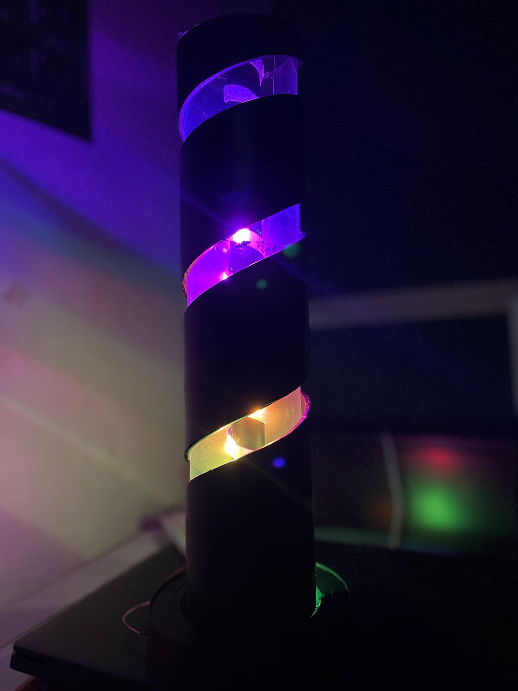
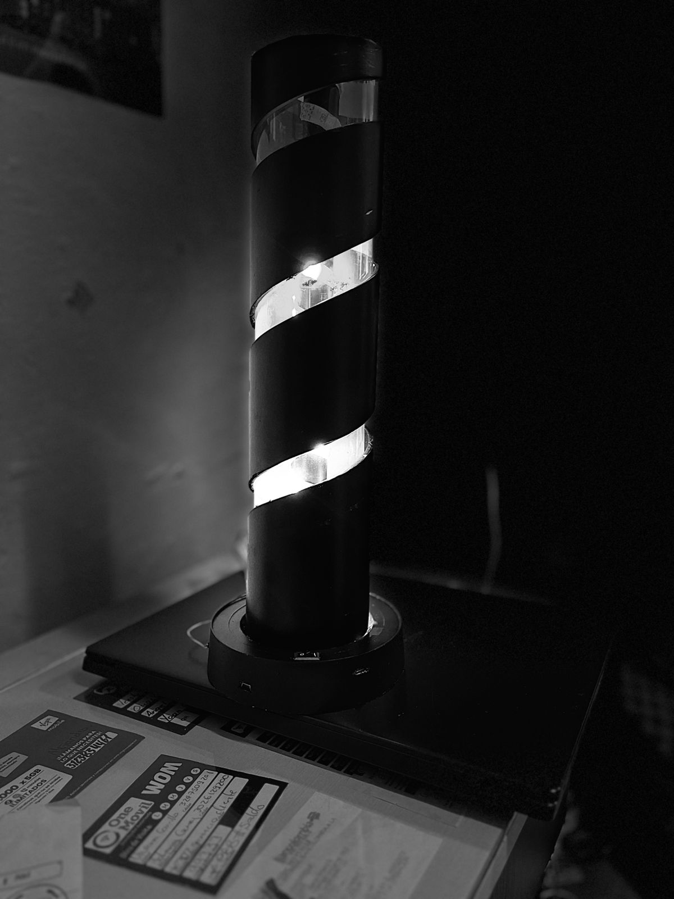

<!DOCTYPE html>
<html lang="es">
<head>
  <meta charset="UTF-8" />
  <meta name="viewport" content="width=device-width, initial-scale=1.0" />
  <title>#Lámpara Inteligente Gamer</title>
  
</head>
<body>
  <header>Lámpara Inteligente Gamer RGB</header>
  

    

      
★★★★★ 4.5 / 5

      <h2>Lámpara RGB Gamer</h2>
      
Cambia de color con la música. Perfecta para gamers y cuartos modernos. Luz suave y colores vivos.

      
      
<b>Precio:</b> $180.900 COP

      <button>Comprar Ahora</button>
    

  

  

    

      <h3 style="text-align: center; color: #00eaff;">Comentarios de Clientes</h3>
      

        
⭐️⭐️⭐️⭐️⭐️ "Muy bonita, hace mi cuarto gamer super cool"

        
⭐️⭐️⭐️⭐️ "Brilla muy bien y cambia con la música, la amo"

        
⭐️⭐️⭐️⭐️⭐️ "No gasta mucha energía y se ve genial"

      

      
      

        <h4 style="color: #00eaff; margin-top: 0;">Deja tu comentario</h4>
        <form id="formComentario" style="display: flex; flex-direction: column; gap: 15px;">
          

            <label style="display: block; margin-bottom: 5px; color: #ccc;">Nombre:</label>
            <input type="text" id="nombre" placeholder="Tu nombre" style="width: 100%; padding: 10px; border-radius: 5px; border: 1px solid #555; background: #2a2a2a; color: white;" required />
          

          
          

            <label style="display: block; margin-bottom: 5px; color: #ccc;">Calificación:</label>
            <select id="calificacion" style="width: 100%; padding: 10px; border-radius: 5px; border: 1px solid #555; background: #2a2a2a; color: white;" required>
              <option value="">Selecciona...</option>
              <option value="5">⭐️⭐️⭐️⭐️⭐️ (5 estrellas)</option>
              <option value="4">⭐️⭐️⭐️⭐️ (4 estrellas)</option>
              <option value="3">⭐️⭐️⭐️ (3 estrellas)</option>
              <option value="2">⭐️⭐️ (2 estrellas)</option>
              <option value="1">⭐️ (1 estrella)</option>
            </select>
          

          
          

            <label style="display: block; margin-bottom: 5px; color: #ccc;">Comentario:</label>
            <textarea id="comentarioTexto" placeholder="Escribe tu opinión sobre el producto..." style="width: 100%; padding: 10px; border-radius: 5px; border: 1px solid #555; background: #2a2a2a; color: white; min-height: 100px; resize: vertical;" required></textarea>
          

          
          <button type="submit" style="width: 100%; padding: 12px; background: #00eaff; border: none; color: black; font-weight: bold; border-radius: 5px; cursor: pointer;">
            Publicar Comentario
          </button>
        </form>
        

          ¡Gracias por tu comentario!
        

      

    

  

  
  

    
    
Esta lámpara cuida el planeta. Es de bajo consumo y tiene certificación Eco+.

  

  <footer>
    Laura Sofía Chacón • Carlos Gómez • Miguel Hernández • Karol Riaño • Cesar Santiago Guasca • Beiker Nivia • Matías Toscano
  

  <h2>Próximamente</h2>
  

</footer>
</body>
</html>
